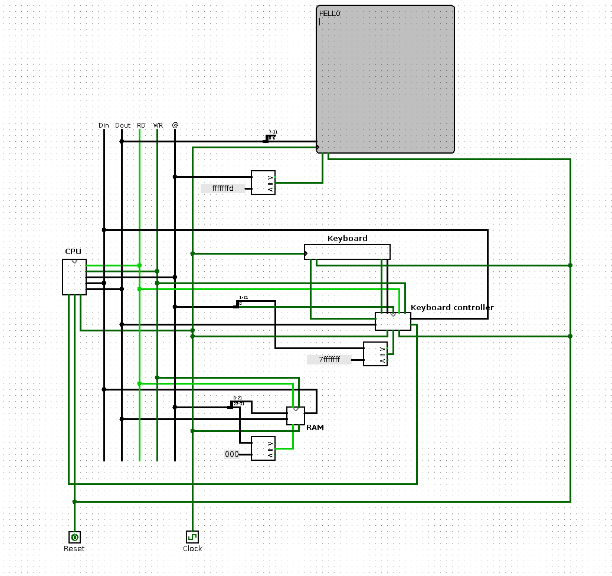

# Computer Architecture Logisim Circuits
Some logisim circuits I did for my computer architecture class.
You can test the HackComputer (from [Nand to Tetris](https://www.nand2tetris.org/)) as follows:
```
java -jar logisim-generic-2.7.1.jar HackComputer/hack-computer.circ
```
If you type something in the keyboard circuit, you should see a serie of characters on the screen circuit.

You can test a MIPS multi-cycles implementation (following roughly the architecture in the Patterson and Hennessy book: *Computer Organization and Design: The Hardware/Software Interface*) in the
`MIPS_multi` directory. The challenge is to load the program (files `prog31_24.txt`, `prog23_16.txt`, `prog15_8.txt` and `prog7_0.txt` in the `ram` component knowing that the program start at address 0. A description of the mono and multi-cycles `MIPS` is given in `description.pdf` at the root of this repository.




